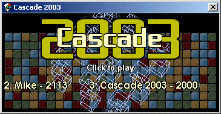



## Cascade 2003 game \- SOooo addictive\!

### Description

Try to clear the tiles, by clicking on tiles that have the same coloured neighbour. the more tiles you clear at once the higher your score (if you can beat 1717, send me a screen shot!). All bitblt and masking - a great learning example. Don't play this in an office - it severely reduces productivity!!!!! 

----

Remember to change the INI file location to a central network directory for multiple users - in the .bas module!! 

----

vote if you're addicted!! :-D
 
### More Info
 

             |
---                |---
**Submitted On**   |2003-09-19 10:54:02
**By**             |[Fosters](https://github.com/Planet-Source-Code/PSCIndex/blob/master/ByAuthor/fosters.md)
**Level**          |Intermediate
**User Rating**    |4.7 (71 globes from 15 users)
**Compatibility**  |VB 4\.0 \(32\-bit\), VB 5\.0, VB 6\.0
**Category**       |[Games](https://github.com/Planet-Source-Code/PSCIndex/blob/master/ByCategory/games__1-38.md)
**World**          |[Visual Basic](https://github.com/Planet-Source-Code/PSCIndex/blob/master/ByWorld/visual-basic.md)
**Archive File**   |[Cascade\_201647549192003\.zip](https://github.com/Planet-Source-Code/fosters-cascade-2003-game-soooo-addictive__1-48600/archive/master.zip)

